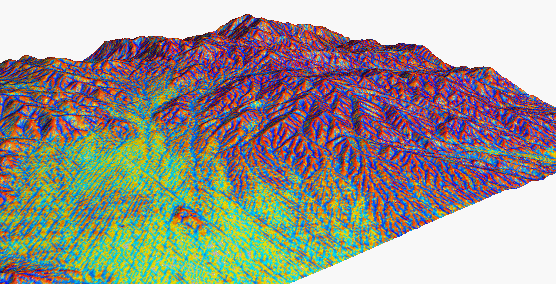

# Friday, March 27, 2020 - Effects of Tractor Passes - Erosion
Effects of Tractor Passes on Hydrological and Soil Erosion Processes in Tilled and Grassed Vineyards 
https://www.mdpi.com/2073-4441/11/10/2118

A very well written paper on how multiple tractor passes create ruts in which rainfall mainly causes damage.
Covers soil penetration resistance based on density, based on dry/wet seasons.

## Abstract
Soil erosion is affected by rainfall temporal patterns and intensity variability. In vineyards, machine traffic is implemented with particular intensity from late spring to harvest, and it is responsible for soil compaction, which likely affects soil hydraulic properties, runoff, and soil erosion. Additionally, the hydraulic and physical properties of soil are highly influenced by vineyards’ inter-rows soil management. The effects on soil compaction and both hydrological and erosional processes of machine traffic were investigated on a sloping vineyard with different inter-row soil managements (tillage and permanent grass cover) in the Alto Monferrato area (Piedmont, NW Italy). During the investigation (November 2016–October 2018), soil water content, rainfall, runoff, and soil erosion were continuously monitored. Field-saturated hydraulic conductivity, soil penetration resistance, and bulk density were recorded periodically in portions of inter-rows affected and not affected by the machine traffic. Very different yearly precipitation characterized the observed period, leading to higher bulk density and lower infiltration rates in the wetter year, especially in the tilled vineyard, whereas soil penetration resistance was generally higher in the grassed plot and in drier conditions. In the wet year, management with grass cover considerably reduced runoff (76%) and soil loss (83%) compared to tillage and in the dry season. Those results highlight the need to limit the tractor traffic, in order to reduce negative effects due to soil compaction, especially in tilled inter-rows.

# DEM resolution, topographic analysis, and erosion modeling
http://fatra.cnr.ncsu.edu/~hmitaso/gmslab/protected/irwin/irwin1.html

Ongoing research into modelling large scale (3000 sq miles!) erosion grids.

Really cool sim outputs, but no further context on how this all comes together (that I could find).
I appears as though this only offers images of simulation output. 

I'll need to look for more simulations.
