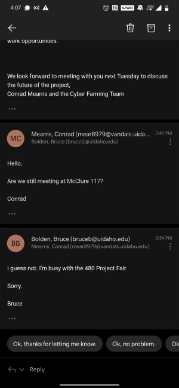
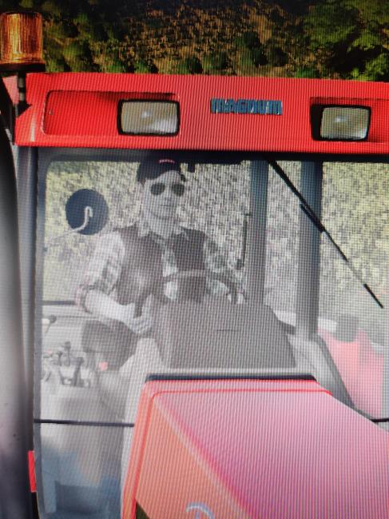

-------

# Semester Two

--------

# August

I began the semester with this email to Bolden,

>Greetings Bruce,

> I am responding on behalf of the Cyber Farming Group - Joshua Dempsey, Damon Schafer, and myself.Last semester, we focused on researching tools, algorithms, and methods that may be useful in completing our client's tasks. Simulating soil erosion caused by heavy equipment usage, modding Farming Simulator 14 to support a better VR experience, and interpolating GIS map information are our three core areas of work to complete.
> We have multiple solid leads for beginning soil erosion calculations in Python, which will require follow on tasks to interface with Farming Simulator.
> We are in the process of discussing the implications of COVID-19 on our work - which may affect the VR task and remote work opportunities.

> We look forward to meeting with you next Tuesday to discuss the future of the project,
> Conrad Mearns and the Cyber Farming Team

The team has set up some times for meetings, and we've started communicating with Dev to figure out what materials we need.

- VR Equipment
- Lab Access
- Copy of Farming Simulator

I think there's extra software needed to connect the VR headset to Farming Simulator? Should be in my notes somewhere. Hopefully the Farming Simulator doesn't need a new key...


# #9-1

We have a meeting with Bolden today to go over the course and expectations, so that'll be good.



3 people showed up to the metting, Bolden was not one of them. I emailed Bolden about it and he sent me a reply as I was leaving Campus.

Kinda upset about that, I would have preferred a remote meeting anyway due to COVID but...


10pm - got word that Dev can hand off Farming Simulator and the hardware. I'll pick that up tomorrow.


# #9-2

Oh! We're using Farming Simulator 19, not 14, that's good. The documentation for Farming Simulator 14 looked very sparse, so I'm feeling much better about working with a modern edition.

The Disc includes an activation key and I'm not sure if it'll work... I don't have a DVD drive in my laptop anyway. We also have no way to share the disc because of the pandemic...


# #9-3

We decided to order the game on Steam and share the account. Here is the credential information - it's attached to my University Email but I'll give that information to Dev so that we can transfer the account over to him.

```
Username: CyberFarmerDev
Password: SJ9thZA8XgQHXAf555
```

Farming Simulator Order Details
```
Account Name
cyberfarmerdev
Total
$26.49
Confirmation code
2610354436656904135
```

Now I just need to figure out how to get it to run on Linux...



Okay, so on NixOS the process wasn't too bad. I needed to get my graphics drivers updated (using an NVIDIA GTX1060) and then it was just a matter of adding steam to my configuration.nix. In the advanced settings for Steam, I enabled Proton and launched FS through it. Looks like everything works! And ti doesn't lag at all, super cool.

# #9-8

There's some kind of snapshot day we need to prepare for it seems? Not sure exactly what we need to do, but Damon has emailed Bolden to figure that out.

Some things we need to focus on:
- make an arbitrary custom map in the Giants editor
- make the GIS based map
- determine risk for soil erosion simulation in Lua vs creating a Python Soil Server

I'm not even sure that we can paint terrain or change map vertex information in Farming Simulator... Will have to come back to that.

# #9-15
The meeting today went well, we planned out a lot of work to be done. There's still so much that needs to be researched but it looks like it will all be doable.

I'm taking on getting a "Hello World" mod running in Farming Simulator. I don't know how to start this yet, the disc Dev gave me won't work on my PC _and_ I'm running NixOS...

We've emailed Bolden about the Snapshots so that we can start preparing for them.

# 9-22

Getting Farming Simulator's GIANT's editor set up on Linux wasn't too bad either. Everything seems to run fine through Wine and on NixOS the setup is still just as easy. Running FS through Steam requires proton (im using 5.0.9) but this is also trivial to set up if you know where the advanced settings are.

You have to edit `./.local/share/Steam/steamapps/compatdata/787860/pfx/drive_c/users/steamuser/My Documents/My Games/FarmingSimulator2019/game.xml` to enable developer controls. This is probably different on other machines because I'm using NixOS.

Mod information has to be placed in

`/home/conrad/.local/share/Steam/steamapps/compatdata/787860/pfx/drive_c/users/steamuser/My Documents/My Games/FarmingSimulator2019`

I've created a makefile that copies the Lua modules and XML data into the mod folder as a zip.

My mod got loaded but I wasn't able to see proof of my lua script executing. How do I test this? If I put 3rd party mods into this folder they work... Mine doesn't...


# 9-29

This documentation is terrible... The most descriptive item about console commands that I've found was here:
https://gdn.giants-software.com/thread.php?categoryId=22&threadId=8514

But I got the mod working! I'll  need to do a writeup and explain how to replicate this, but it's not too difficult. It's just nearly impossible to find a good source of information.

In order to support future work with preforming more intensive simulations (like soil erosion + also to allow developers to build tools in ANYTHING not just lua), I'll work on finding a way to "call out" of Farming Simulator into some other API, REST would be helpful.


# #10-16

I now know that we are using Lua 5.1 which is sandboxed. Shit.

Here's some code I've been testing.

```lua

-- get the version
print(_VERSION)

-- test default library facilities
print(math.sqrt(64))

-- testing string->code
f = loadstring("i = i + 1")
i = 10
print(i)
f()
print(i)
-- this outputs 10, then 11. success!

-- https://apocrypha.numin.it/talks/lua_bytecode_exploitation.pdf
-- maybe we can break lua?
-- this causes the module not to compile...
print(=tostring(string.upper))


-- we may be able to call load file, but Im not sure what the path would be...
g = loadfile("./small.lua")
g()
g("hello!")

-- small.lua is
-- function foo (x)
--     print(x)
-- end

-- This should load the file and save it as callable, output should be "Hello!"

-- This all fails though...

-- Aha, we can't open files
-- we cannot call io.open with "r"
print(io.open("cyberxxx", "r"))

-- But we can call io.open with "w"
local c = assert(io.open("cyberxxx", "w"))
c:write("hello!")
assert(c:close())
-- did this work? I cant remember. I think failure is the only thing that happened
-- it worked! as if thats helpful tho
-- well, maybe if we write code into FS, we can save the info to file as to preserving

-- There's no way to access file or network IO though... which means we won't be able to integrate any soil sims...

```


This basically makes all of the research I've done last semester useless. Kind of panicking now, maybe we can hack it?


5.1 escape
https://gist.github.com/corsix/6575486

5.2 escape
https://github.com/erezto/lua-sandbox-escape

seems to get close

# 10-14

I cannot, for the life of me, get these hacks to work. 

The 5.2 won't work obviously... because FS 2019 uses Lua 5.1, but luckily I found that 5.1 hack as well. The other thing though, is that this shit is so old it only works on 32x systems.

I've been trying to pull the code apart and understand it so that I can update it, but I've been struggling to work on this and stay caught up in Compilers and Theory of Computation.

I can probably spend some extra time on this though.


AHhh this is going to take so much time.

```lua
if string.dump(function()end):sub(1, 12) ~= "\27Lua\81\0\1\4\4\4\8\0" then
  error("This generator requires a 32-bit version of Lua 5.1")
end
```

I can get rid of this check to get the exploit started, but I don't know enough about the Lua VM to actually correct any of the following code.

This is pretty cool stuff though, notice that instead of asking for version or OS information, it just compares the byte-literal of an empty function.

However, this is what I get...
```lua
print(string.dump(function()end):sub(1, 12))
>uaR
```

I need to compare bytes, so instead let's convert

```lua
s = string.dump(function()end):sub(1, 12)
length = string.len(s)
for i=0,length,1 do print(string.byte(s, i)) end
>27
>76
>117
>97
>82
>0
>1
>4
>8
>4
>8
>0
```

```
\27     >   27
L       >   76
u       >   117
a       >   97
\81     >   82  // interpreter is Lua 5.2, not 5.1, this is okay
\0      >   0
\1      >   1
\4      >   4
\4      >   8   // Idk what this means, but this is why the check fails
\4      >   4
\8      >   8
\0      >   0
```


What I need to do next, is fix this function to work on x86
```lua
local function f2ii(x) -- Convert double to uint32_t[2]
    if x == 0 then return 0, 0 end
    if x < 0 then x = -x end
    
    local e_lo, e_hi, e, m = -1075, 1023
    while true do
    e = (e_lo + e_hi)
    e = (e - (e % 2)) / 2
    m = x / 2^e
    if m < 0.5 then e_hi = e elseif 1 <= m then e_lo = e else break end
    end
    
    if e+1023 <= 1 then
    m = m * 2^(e+1074)
    e = 0
    else
    m = (m - 0.5) * 2^53
    e = e + 1022
    end
    
    local lo = m % 2^32
    m = (m - lo) / 2^32
    local hi = m + e * 2^20
    return lo, hi
end
```

# #10-20

I need to take this week off to work on Compilers. I'm having an incredibly difficult time staying on top of everything.


# #10-27

Got an email from Bolden, wasn't a reply.

Seem's like there's a wrokshop on how to build the Wiki page, so I guess I have to drop some studying to attend.

Made a name for the Wiki: "Platform for XR Agriculture Education"

Sent out an email to Bolden for the rubber stamp on the name, because we apparently need it approved before we can make the Wiki. I wonder how long it'll take before he replies? I'm not going to guess lol.

# #10-29

No response for Bolden, so I'm going ahead and just making the Wiki. We can always delete it if he says no.

I asked Damon if he by chance sent multiple copies of the original Bolden email, and he actually has. These are the dates that he sent our email.

```
FWD: Tuesday, September 15, 2020 3:18:20 PM
FWD: Monday, September 21, 2020 5:39 PM
FWD: Tuesday, October 13, 2020 4:13 PM
FWD: Tuesday, October 27, 2020 4:25 PM
```

I can't remember when the original email was sent, Damon only gave me the forwards.

They might only appear as forwards because he forwarded them to me, so September 15th may have been the first actually.

This was the email.

```

Dear Mr. Bolden,

I had a few questions about CS481 this semester. I did want to meet in person to discuss these, but I decided to just put them in this email.

    Is there a list of deliverables and/or scheduled snapshot days? You did mention snapshot days at the beginning of the semester. The only document that comes close to describing deliverables is here, so should my team and I just follow this one?
    How is our final grade calculated?
    Are there any deliverables you need to see right now?
    Is this course different from the traditional Spring-Fall sequence?

These are the questions that came to mind. My team and I are still working on the project. Despite the challenges so far, we are making some progress.

Thanks,
Damon E Schafer
```


# #11-8

- been working on the outline of the wiki and creating a list of things that need done. This is what I have so far

- Links to Logbooks
- Minutes
- Handoff materials
- Demo/vids
- Update Schedule

Which means I need to also flesh out my  logbook, recompile it, scan in handwritten notes, etc etc. dang

I'm not sure what needs to be included in 'handoff materials' yet. I've just been perusing old resources that our team accidentally found and we've that this project is so much older than what we thought (by about a year, but still).

There's very, very little to show for all the combined effort of all of the history of this project. That being said, our team has really been struggling to work with the Farming Simulator API to get anything integrated, it's consumed probably 90% of our time.


# #11-16

Working on the wiki, it's really frustrating to only now find other hints of the scope of what we've been trying to do. I filled out more about the background to the project, stuff about precision ag etc. The most frustrating aspect about all of this is how little anyone else seems to care about this project. Bolden STILL has not replied to our questions. I'm worried that we will be judged harshly because we didn't do our project "correctly".

This hasn't been the greatest insult to my time that the University has thrown at me though, Software Engineering and Algorithms are still the kings of worst "education" experiences I've ever had to endure, but this is pretty close up their. 

At least with the other two classes, we actually received feedback.


# #11-21
I've been focusing primarily on editing my logbook, working on grammar and spelling edits.

The only other thing I have planned is to do the same for the Wiki, Once I my logbook and my team's copies as well, I can link them on to the Wiki and get that wrapped up.

Re-reading has made me think I should cover a few more points.

## Farming Simulator should be abandoned

Yea it's cool to have a full game ready to play VR in, _but you can't use Farming Simulator in VR unless you purchase both Farming Simulator, VorpX, and the gear.

We got f'd by assuming we needed to stick with Farming Simulator. I couldn't get the Lua 5.1 escape to work on x64 which meant implementing any sufficiently advanced modifications would be impossible - no callouts to connect state-of-the-art soil simulations, and also map manipulation is a big NO.

If any of the previous teams had tried to implement anything that we (I) had worked on, they would have realized this and informed the client. This alone has been a huge waste of time.

Sure, you can still write some mods for Farming Simulator that might be able to function for Dev's purposes, but only a few. Here are some features that while Dev never mentioned, I dreamed of when thinking of the future of this project.

- Precision Fertilizer
  - The actual goal of this project is to create simulations to train people on how to use new technologies for agriculture. As such, certain devices need to be implemented into the game because they're used extensively in this new field. iPad controlled drones with specialized cameras, GPS technology, and sensors would need to be added.
    - Implementing "GPS" into Farming Simulator has already proven to be a monumental task in terms of a semester's worth of work.
    - Drones _can_ be implemented into Farming Simulator, but would need to be completely reworked (with a Lua Escape) in order to provide automated controls, and advanced camera feedback (IR at the very least would be incompatible) (Confer: https://www.youtube.com/watch?v=XVa7ewjSLsE)
    - Sensors would need to 'fake' any and all data about crops. This could be done, but it would tricky to make the data usable.

- Soil Erosion
  - The idea behind integrating some kind of soil erosion simulation is to try and understand how certain automated tractor paths may hurt the quality of a farm of long periods of time. As such, we would have liked to have an automated tractor path actual 'detent' a simulation field so that long term effects of this path could be visualized for students.
    - Ruts in the mud will hold water, and possibly create channels that displace the topsoil. Confer with my previous semester's worth of research for more information.