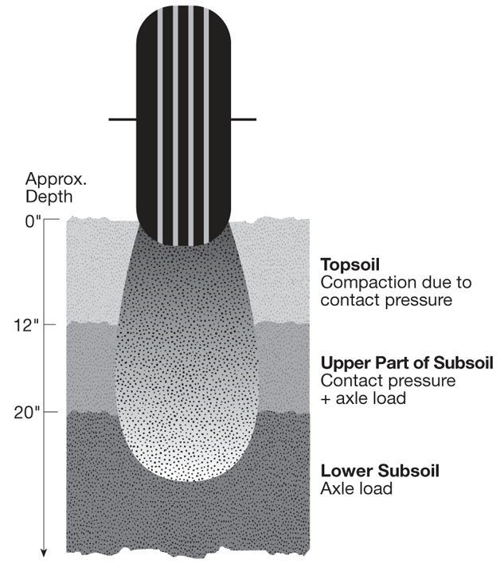

meetings
feb 21

march 3rd

This group is to be known under the working name of "Dev's Dev's" for the mission of providing quality, client solutions to real world challenges in GIS interpolation and pathfinding.

I'm not really sure what to be writing about, what to be researching. I guess this is just a diary? Dear Diary: I wish there was some inkling of direction to take here. I can research and write until my fingers blead but it does nothing for the project, or for the client.

# Statement of issues
Dev wants us to firstly - fix the GIS data in Farming Simulator, and also work on algorithms for controlling tractor movements based on optimizations for time, and soil erosion. I'm not as interested in the more general pathfinding algorithms - I'm more interested in what the soil erosion algorithms look like.

In general, the question is how can we create an self driving (or assisted) tractor that not only covers the area that it needs to cover, but also prevents soil erosion? This comes with the context that the if the tractor drives on the same path many times over and over again, the soil will erode. What does this really mean though? Could we simply plot a naive course in which a tractor just varies it's course by plus or minus the width of it's tires?

What do human farmers look for when driving to avoid tractor-based erosion?

Are there tools that could help us model soil erosion already?

# Trends in Robotics in Ag
https://www.hindawi.com/journals/tswj/2014/404059/

Very interesting paper, effectively covers the network architecture for self driving tractors (RHEA system).

Does not cover anything on erosion - but from this we may be able to consider the full potential of percision movements - how much control do developers have over concerns of track-erosion?

## Abstract
Computer-based sensors and actuators such as global positioning systems, machine vision, and laser-based sensors have progressively been incorporated into mobile robots with the aim of configuring autonomous systems capable of shifting operator activities in agricultural tasks. However, the incorporation of many electronic systems into a robot impairs its reliability and increases its cost. Hardware minimization, as well as software minimization and ease of integration, is essential to obtain feasible robotic systems. A step forward in the application of automatic equipment in agriculture is the use of fleets of robots, in which a number of specialized robots collaborate to accomplish one or several agricultural tasks. This paper strives to develop a system architecture for both individual robots and robots working in fleets to improve reliability, decrease complexity and costs, and permit the integration of software from different developers. Several solutions are studied, from a fully distributed to a whole integrated architecture in which a central computer runs all processes. This work also studies diverse topologies for controlling fleets of robots and advances other prospective topologies. The architecture presented in this paper is being successfully applied in the RHEA fleet, which comprises three ground mobile units based on a commercial tractor chassis.

# Soil Erosion Simulation / Study Tool
Sounds like it effectively meets (most) of the requirements of our client - granted it's not a VR simualtion, but it covers education of the USLE equation and how to effectively make decisions using such a model.

https://www.tandfonline.com/doi/abs/10.1080/00958964.1987.9942736

## Abstract
The need for education and understanding about the continuing soil erosion problem is acute. Most segments of the population have little knowledge of the critical impacts erosion can have on the environment. The use of the Soil Conservation Service model for erosion determination, the Universal Soil Loss Equation (USLE), is a good perceptual tool to show the impacts of human and natural action on the land. Micro-DYNAMO, a special-purpose computer simulation language, was programmed to simulate the USLE under several different environmental and farming practice scenarios. This type of simulation will never duplicate nature but will allow natural processes to be evaluated and this information to be used for rational decision making and understanding.

# Effects of Tractor Passes - Erosion
Effects of Tractor Passes on Hydrological and Soil Erosion Processes in Tilled and Grassed Vineyards 
https://www.mdpi.com/2073-4441/11/10/2118

A very well written paper on how multiple tractor passes create ruts in which rainfall mainly causes damage.
Covers soil penetration resistance based on density, based on dry/wet seasons.

## Abstract
Soil erosion is affected by rainfall temporal patterns and intensity variability. In vineyards, machine traffic is implemented with particular intensity from late spring to harvest, and it is responsible for soil compaction, which likely affects soil hydraulic properties, runoff, and soil erosion. Additionally, the hydraulic and physical properties of soil are highly influenced by vineyards’ inter-rows soil management. The effects on soil compaction and both hydrological and erosional processes of machine traffic were investigated on a sloping vineyard with different inter-row soil managements (tillage and permanent grass cover) in the Alto Monferrato area (Piedmont, NW Italy). During the investigation (November 2016–October 2018), soil water content, rainfall, runoff, and soil erosion were continuously monitored. Field-saturated hydraulic conductivity, soil penetration resistance, and bulk density were recorded periodically in portions of inter-rows affected and not affected by the machine traffic. Very different yearly precipitation characterized the observed period, leading to higher bulk density and lower infiltration rates in the wetter year, especially in the tilled vineyard, whereas soil penetration resistance was generally higher in the grassed plot and in drier conditions. In the wet year, management with grass cover considerably reduced runoff (76%) and soil loss (83%) compared to tillage and in the dry season. Those results highlight the need to limit the tractor traffic, in order to reduce negative effects due to soil compaction, especially in tilled inter-rows.

# Building compound models for surface processes
https://www.agu.org/Events/SCIWS8-Exploring-Surface-Processes-how-to-build-coupled-models

Looks like this article could be valuable - the Community Surface Dynamics Modeling System is an NSF funded initiative for software analysis on surface processes. Over 200 models, tools, and cyberinf.

It appears the tooling is primarly built in Python, and includes multiple tutorials and jupyter notebooks to get users started. It costs $150 ($75 for students)

https://www.agu.org/Events/SCIWS8-Exploring-Surface-Processes-how-to-build-coupled-models

Ah, actually it's a workshop, not strictly an article.

# Fast Hydraulic Erosion Simulation - GPU
http://www-ljk.imag.fr/Publications/Basilic/com.lmc.publi.PUBLI_Inproceedings@117681e94b6_fff75c/FastErosion_PG07.pdf

Provides methods, equations, and algorithms for 3D celluar erosion simulation. Alone, I don't think is too helpful - however if the methods described here were paired with soil compaction algrotihms, then we could effectively simulate would long-term tractor compaction would do to the terrain.

What do underground root structures do to the soil compaction? I would imagine this is different between crops - vineyards vs wheat for instance.

## Abstract

Natural mountains and valleys are gradually eroded byrainfall and river flows.  Physically-based modeling of thiscomplex phenomenon is a major concern in producing re-alistic synthesized terrains.  However, despite some recentimprovements, existing algorithms are still computationallyexpensive, leading to a time-consuming process fairly im-practical for terrain designers and 3D artists.In this paper, we present a new method to model the hy-draulic erosion phenomenon which runs at interactive rateson today’s computers.  The method is based on the velocityfield of the running water, which is created with an efficientshallow-water fluid model. The velocity field is used to cal-culate the erosion and deposition process, and the sedimenttransportation process.  The method has been carefully de-signed to be implemented totally on GPU, and thus takesfull advantage of the parallelism of current graphics hard-ware.  Results from experiments demonstrate that the pro-posed method is effective and efficient. It can create realis-tic erosion effects by rainfall and river flows, and producefast simulation results for terrains with large sizes.

# Estimating erosion from GIS data
https://www.jswconline.org/content/58/3/128

This would pair nicely with the simulation techniques I found earlier - we could collect data on our local area to show specifically what the erosion would look like for Moscow vs say, SoCal.

Seeing as we alreayd have to dig into GIS data techniques, this would be worth spending a week or 2 on.

## Abstract
A comprehensive methodology that integrates erosion models, Geographic Information System (GIS) techniques, and a sediment delivery concept for estimating water erosion and sediment delivery at the watershed scale was presented. The method was applied to a typical agricultural watershed in the state of Idaho, which is subject to increasing soil erosion and flooding problems. The Revised Universal Soil Loss Equation (RUSLE) was used to assess mean annual water erosion. The Sediment Delivery Distributed (SEDD) model was adapted to determine sediment transport to perennial streams. The spatial pattern of annual soil erosion and sediment yield was obtained by integrating RUSLE, SEDD, and a raster GIS (ArcView). Required GIS data layers included precipitation, soil characteristics, elevation, and land use. Current cropping and management practices and selected, feasible, future management practices were evaluated to determine their effects on average annual soil loss. Substantial reduction in water erosion can be achieved when future conservation support practices are applied. The integrated approach allows for relatively easy, fast, and cost-effective estimation of spatially distributed soil erosion and sediment delivery. It thus provides a useful and efficient tool for predicting long-term water erosion potential and assessing erosion impacts of various cropping systems and conservation support practices.

# LandLab
https://www.hatarilabs.com/ih-en/modeling-of-soil-erosion-with-landlab-in-python-free-software

Open source python based land / erosion modelling tool! I love it when my work is already 50% complete.

Will need to examine how fine the siulation can be set to for this tool set, I would imagine that we need to be fairly percise if we are trying to describe the effects of pathing on soil (this toolset can model volcanic and glacial activity - which is obviosuly a couple magnitudes larger in scale.)

## From site
Landlab is a model environment based in Python for the numerical model of landscape models. The software is designed for scientific fields and calculates the dynamics of earth surface such as geomorphology, hydrology, glaciology, stratigraphy and others related.

Landlab components can calculate fluxes like water, sediments, glaciers, volcanic material and landslides. This calculus is made through terrain grids.

Landlab is open source and has been designed to accelerate the development of models providing tools to generate grids, components of interoperable processes and tools for input, output and represent data.

https://landlab.github.io/#/

# pyBadlands

More python land simualtion stuff - this appears to be more directed at oceanic modelling

https://www.ncbi.nlm.nih.gov/pmc/articles/PMC5896951/

## Abstract
Understanding Earth surface responses in terms of sediment dynamics to climatic variability and tectonics forcing is hindered by limited ability of current models to simulate long-term evolution of sediment transfer and associated morphological changes. This paper presents pyBadlands, an open-source python-based framework which computes over geological time (1) sediment transport from landmasses to coasts, (2) reworking of marine sediments by longshore currents and (3) development of coral reef systems. pyBadlands is cross-platform, distributed under the GPLv3 license and available on GitHub (http://github.com/badlands-model). Here, we describe the underlying physical assumptions behind the simulated processes and the main options already available in the numerical framework. Along with the source code, a list of hands-on examples is provided that illustrates the model capabilities. In addition, pre and post-processing classes have been built and are accessible as a companion toolbox which comprises a series of workflows to efficiently build, quantify and explore simulation input and output files. While the framework has been primarily designed for research, its simplicity of use and portability makes it a great tool for teaching purposes.

# Contour Planning

https://www.researchgate.net/publication/235984970_Contour_Planting_A_Strategy_to_Reduce_Soil_Erosion_on_Steep_Slopes

Again, it appears a lot of work has already been done! This paper outlines GPS guided tilling machines and contour planning to reduce soil erosion on steep slopes. This is _exactly_ what our client is looking for.

This also captures some nice statistical elements - such as planning and modelling for 100 year storms.

## Abstract

Practices that combine GPS-based guidance for terrain contouring and tillage for runoff detention have potential to increase water infiltration and reduce runoff. The objective of this study was to investigate contour planting as a means to reduce soil erosion on steep slopes of the Columbia Plateau dryland wheat region. An exploratory field study was conducted on a Ritzville silt loam (coarsesilty, mixed, superactive, mesic Calcidic Haploxerolls) and 0-20 percent slopes. Planting was performed with a deep furrow drill on the contour to a depth of 20 cm. Our results demonsrate that a strip of deep-furrow seeding precisely contoured on the upper shoulder slope should provide sufficient detention storage to capture and hold the runoff from a 100-yr 24-h storm if the contour strip area was approximately 2 % of the runoff collection area. This research also examined artificial neural networks for generating routing maps that optimize seeding on precise, GPS-guided contours. A contouring algorithm was evaluated in which the direction of a tractor is determined by contour-based neural activity whereby neurons corresponding to regions of the terrain of similar height to that of the tractor’s current position receive the greatest excitatory input. The contour region, therefore, has the global effect of influencing the whole state space to attract the tractor in the right direction. Keywords: contour planting, soil erosion, artificial neural networks

## Deeper dive - DATE
Cf Torisu et al. (2002), Ashraf et al. (2003), Zhu et al. (2005)
All used ANN for incline, slipage, velocity, rate-of-steering control

> A discrete 2-D surface of 
a DEM forms the structure for the ANN (Fig. 2).  Lateral connections between 
neurons become adjacent connections to neighboring cells

How do they model erosion though?

>  Further research is needed to evaluate the effectiveness of precision 
contouring with a deep furrow drill in providing resistance to water erosion.

Ah, voodoo. They discuss a few equations used, but overall don't provide enough content to make the study reproducible. 

>  A field study was conducted in a farm field near Echo, Oregon on and 
above the shoulder position of a 30% hill slope.  The climate is semiarid with 
average annual precipitation of 280 mm (11-in) with most falling October through 
March.  Soils are derived from loess parent material and are classified as Ritzville 
silt loam (coarse silty, mixed, superactive, mesic Calcidic  Haploxerolls).  The 
field has been in a summer fallow-winter wheat rotation where the primary tillage 
consists of disking or chiseling, followed by cultivation and rodweeding 
operations.  The study was conducted in the fallow phase of the rotation. 

There is a lot more information here than I would have expected based on conversations with our client. 

## Some questions

Is this model robust enough to be translated to other climates and terrains?
How effectively does it determine erosion potential?
How do you effectively measure contour accuracy against erosion potential?
What ANN architecture did they create? They mention how ANN's work but thats kind of insulting to be honest... Cf past Cfs on older ANN archs.

It may be more effective to pair an ANN with a reward based network - in any case I'm sure there is a lot of literature on self driving cars that this paper had no access to (published in 2010, it's been a while!)

## Avoiding Soil Compaction

https://extension.psu.edu/avoiding-soil-compaction

Do the simulations in previously found models account for varying layers of soil compatcion? How do they model soil? Does it even matter?

> (1) surface tillage (moldboard plowing in most experiments) did not completely alleviate surface compaction and (2) deep penetration of frost did not alleviate lower subsoil compaction (most experiments were located in northern latitudes where soil is commonly frozen to 40-50 inches in winter).

This described a lot of very interesting ways to avoid compaction in depth - by creating a 'hardpan' layer of soil, compaction in lower subsoil layers can be reducued - as well as simply making the tire load lighter.

Do previous simulations account for tractor / tire load? I would hope so, it's an important factor in slipage...

There is also an analysis on the plasticity of soil at the end of this paper which links the soil water content and soil denstity to compressibility.

## Intro

Twenty-first-century farm economics stimulate farmers to increase the size of their operations. To improve labor efficiency, farm equipment usually increases in size. Tractors, combines, forage harvesters, grain and forage wagons, manure spreaders, and lime trucks are all bigger than they used to be. Twenty years ago, for example, 2.5-ton box-type manure spreaders were common in Pennsylvania, whereas today liquid manure spreaders may weigh 20 or 30 tons. The increasing size of farm equipment may cause significant soil compaction that can negatively affect soil productivity as well as environmental quality.

We, the members of this team, affirm that we have established this contract with input and consensus of all members. By our signatures, we commit to compliance with the contract for the benefit of all members and the team as a whole.

Signatures that are added can be verified by checking this documents source file against Git.

Conrad Mearns - March 3rd

Damon Schafer - March 3rd, 2020

Joshua Dempsey - March 3rd, 2020
